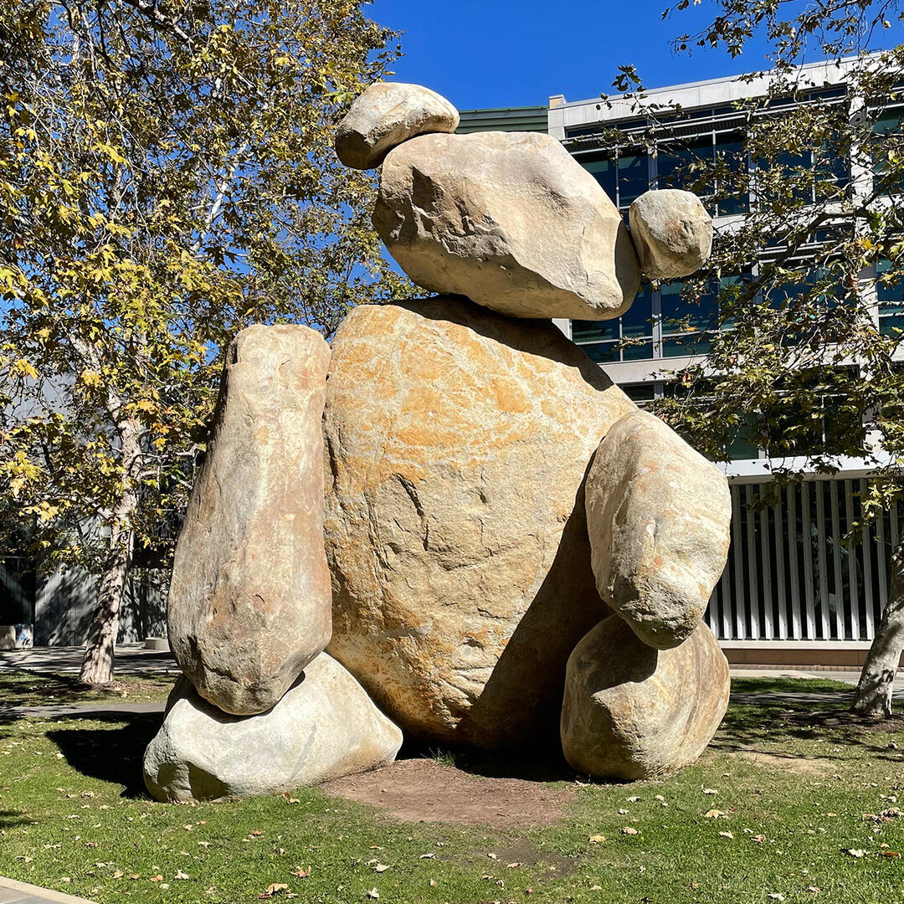

# CSE 110 Lab 1

Hello, my name is **Yuan-Kai Yang** and I'm a *2nd year CS student* at <ins>UCSD</ins>.

Something I always say is

> Heck yeah

This is my Quote Code: `print("This is literally my favorite class")`

Here is a block of code
```
def myFunction():
    x = 1 + 1
    myFunction()
    return 0
```

My favorite website is [Google.com](https://google.com/)

Link to the top heading section: [Go to Top](#cse-110-lab-1).

[Click this for the other MD file, which is a relative link](extra.md)

This is my ordered list
1. Pines
2. Bistro
3. OVT
4. Cafe V

This is my unordered list
* CSE 110
* CSE 105
* COGS 1
* VIS 21A

My Task List
- [x] Complete CSE 110 lab 1
- [ ] Complete CSE 105 HW 1
- [ ] Complete pre-class reading for COGS 1
  